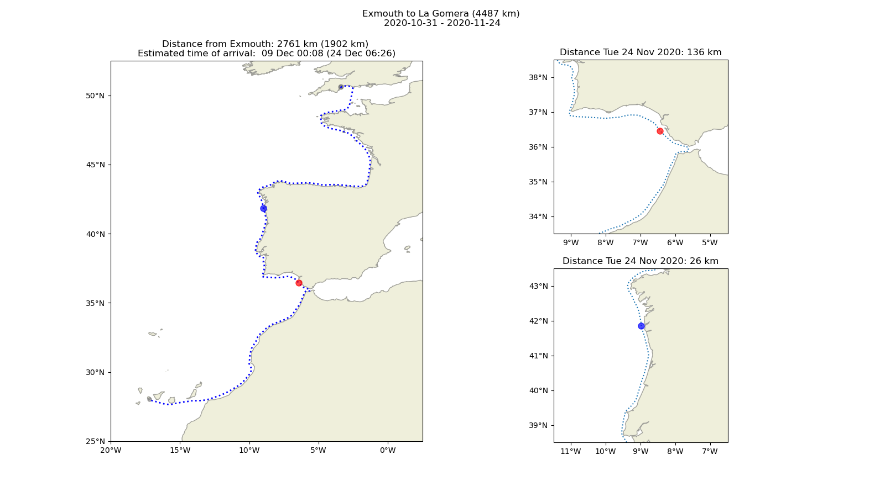

# Virtual Rowing Tour

## Logbook 

The [rowing_log.csv](https://github.com/BHFock/virtual-rowing-tour/blob/main/log/rowing_log.csv) serves as input for the rowed meters.

## Software installation

The required Python packages can be installed via https://www.anaconda.com

 conda install -c conda-forge iris

 conda install -c conda-forge iris-grib

 conda install -c conda-forge geopy

 conda install -c conda-forge fastkml
